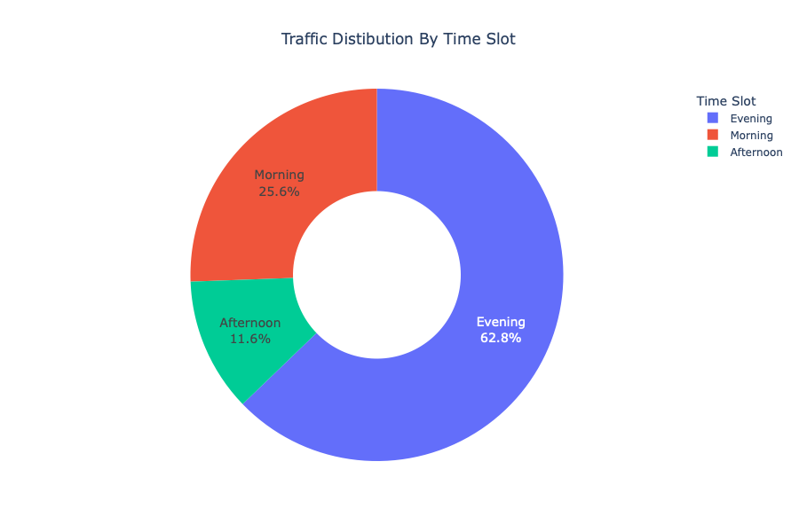
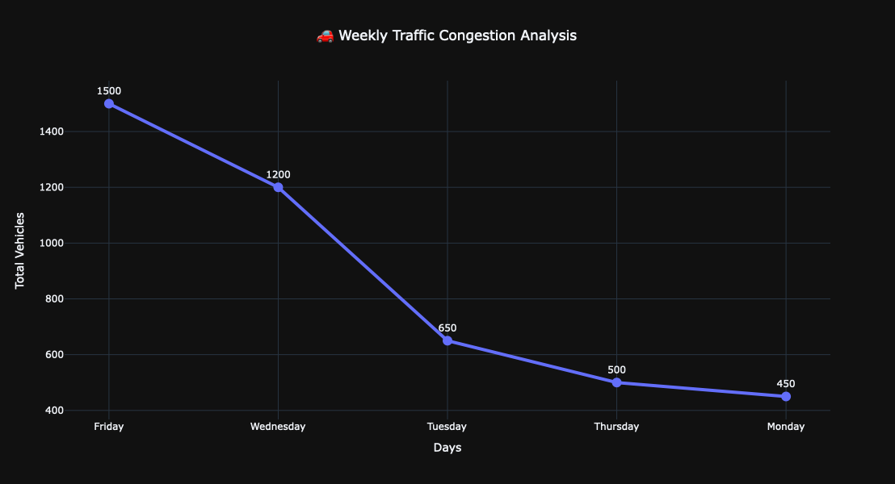
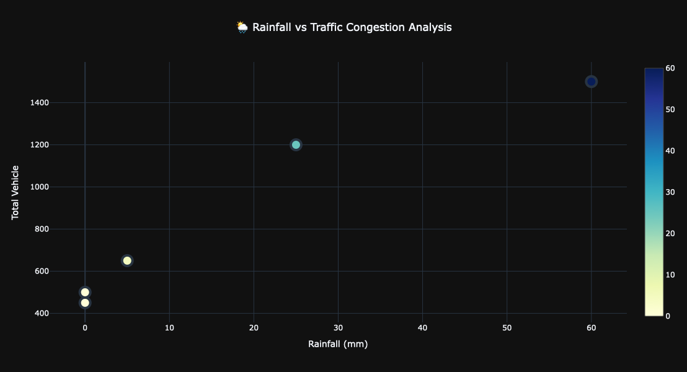
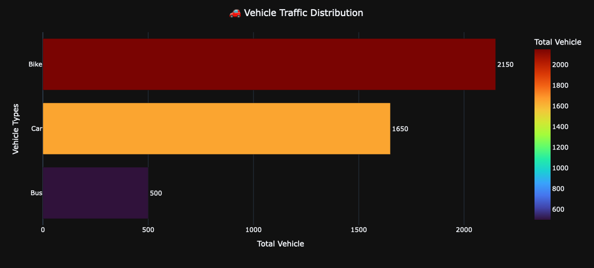

# 🚦 Smart City Traffic Analytics & Congestion Prediction

## 📌 Project Overview

An AI-powered Traffic Intelligence Platform that analyzes traffic patterns and predicts congestion levels before they occur.

This project combines Data Analytics, Machine Learning, and Interactive Visualization to transform raw traffic data into actionable urban intelligence.

---

## 🎯 Problem Statement

Traffic congestion leads to:

- Increased travel time
- Higher fuel consumption
- Environmental pollution
- Reduced economic productivity

This project aims to predict congestion levels using Machine Learning and provide real-time traffic insights through interactive dashboards.

---

## 🚀 Features

✅ Traffic Data Analysis

✅ Data Cleaning & Feature Engineering

✅ Exploratory Data Analysis (EDA)

✅ Interactive Traffic Dashboard

✅ Congestion Prediction

✅ Random Forest Classification Model

✅ Model Performance Evaluation

✅ Real-Time Traffic Intelligence Visualization

---

## 🛠️ Technology Stack

### Data Processing
- Python
- Pandas
- NumPy
- MySQL

### Data Visualization
- Matplotlib
- Seaborn
- Plotly

### Machine Learning
- Scikit-Learn
- Random Forest Classifier
- Feature Engineering

---

## 📊 Project Workflow

Raw Traffic Data
↓
Data Cleaning
↓
Feature Engineering
↓
Exploratory Data Analysis
↓
Model Training
↓
Congestion Prediction
↓
Interactive Dashboard

---

## 📈 Model Performance

| Metric | Score |
|----------|----------|
| Accuracy | 94% |
| Precision | 0.93 |
| Recall | 0.92 |
| F1 Score | 0.92 |

---

## 📷 Project Screenshots

### Dashboard

### Traffic Analytics

### Congestion Insights

### Model Results

---

## 💡 Business Impact

- Smarter Cities
- Better Mobility
- Reduced Congestion
- Data-Driven Decisions
- Route Optimization
- Predictive Traffic Control

---

## 🔮 Future Improvements

- Real-Time IoT Sensor Integration
- Live Traffic API Support
- Deep Learning Models
- Smart Signal Optimization
- Mobile Application Deployment

---

## 👨‍💻 Author

**Yash Patel**

B.Sc. Information Technology Student

Passionate about:
- Data Science
- Machine Learning
- AI
- Analytics

---

### ⭐ If you found this project useful, please give it a star.

## 🙏 Jay Swaminarayan
